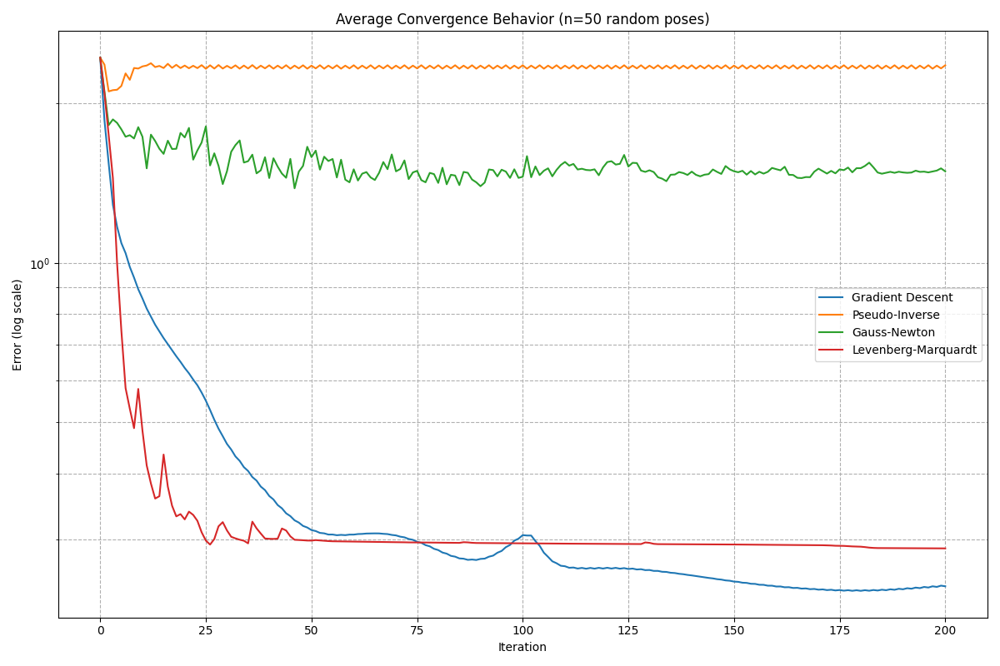

### Inverse Kinematics
Let's talk about numerical methods for solving inverse kinematics (IK) problems because analytical solutions are boring and not always possible.For this purpose, we need to call our friend Jacobian.

So, what's a Jacobian?
Jacobian matrix defines the relationship between the velocities of the end-effector and the velocities of the joints. In other words,how small changes in the joint angles correspond to changes in position and orientation of the end-effector ?
This is a non-linear transformation. 

Consider desired joint position $\theta_D$ and current joint position $\theta_i$. Then, the first order Taylor expansion :
$$f(\theta_D)= f(\theta_i) + \frac{\delta f(\theta)}{\delta \theta}(\theta_D-\theta_i)+ O(\theta^2)$$
Simplifying this to get:
$$\theta_D-\theta_i=\frac{\delta f(\theta)}{\delta \theta}^{-1}(f(\theta_D)-f(\theta_i))$$
or :
$$\Delta \theta = J^{-1}(\theta) \Delta X$$
Note that $\Delta X$ calculation requires evaluating forward kinematics for desired and current joint states.
If the learning rate is too high, there would be too much oscillations and non-convergence might occur.
The optimization objective:
$$\arg \min_{\theta} ||T_{end}-H(\theta)||$$
subject to $\theta\geq \theta_{min}$ and $\theta\leq \theta_{max}$. $T_{end}$ is the end effector's desired state and $H(\theta)$ is the current state.
#### When Jacobian is not invertible
##### Jacobian Pseudo Inverse
$$\Delta \theta = J^*\Delta X$$
Pseudo inverse gives the best possible solution in the sense of least squares. It tends to have stability problems in the neighborhoods of singularities
$$J^*=(J^TJ)^{-1} J^T$$
##### Jacobian Transpose
$$\Delta \theta =J^T \Delta X$$
For sufficiently small $\alpha>0$, updating the angles by Jacobian Transpose is justified:
$$\theta_{n+1}=\theta_n-\alpha J^T \Delta X$$
This method is fast compared to others but suffers from low quality solutions for multiple end effector systems. 

### Gauss-Newton
It's second-order method for doing IK. In contrast to Newton-Raphson method, Gauss-Newton approximates Hessian matrix with the Jacobian. Also, compared to Gradient Descent, notice there is no $\alpha$ learning rate to be specified:
$$\theta_{n+1}=\theta_n - J^* \Delta X=$$
$$=\theta_n-(J^TJ)^{-1} J^T\Delta X$$

Even here, one can provide $\alpha$ learning rate (step size) for damping the updates, similar to Levenberg-Marquardt approach.
### Lavenberg-Marquardt
Combination of both gradient descent and Gauss-Newton methods. Its update rule is given by:
$$\theta_{k+1}=\theta_k - (J^TJ+\lambda I)^{-1}J^T \Delta X$$
where $\lambda$ is a damping parameters. When the damping factor is large, the algorithm behaves more like gradient descent. When the damping factor is small, it behaves more like Gauss-Newton 


### Algorithm Performance Summary

To check the performance of the algorithms,for 100 randomly generated 6D target poses, I run the IK solver for each of the three methods. The results are shown below:
```python
python scripts/compare_ik_convergence.py
```

The average number of iterations, final error, and time taken for each algorithm are shown in the table below:

| Algorithm | Avg Iterations | Avg Final Error | Avg Time (s) | Success Rate (%) |
|-----------|----------------|-----------------|--------------|------------------|
| Gradient Descent | 200.00 | 0.24502138 | 0.0100 | 0.0 |
| Pseudo-Inverse | 200.00 | 2.36082066 | 0.0155 | 0.0 |
| Gauss-Newton | 164.30 | 1.16092590 | 0.0101 | 22.0 |
| Levenberg-Marquardt | **125.74** | **0.17335226** | **0.0182** | **40.0** |

On average, Levenberg-Marquardt achieves much lower error than Gradient Descent and converges faster than Gauss-Newton. Of course, you might say this is not a fair comparison since one can tune the parameters of the other two methods to achieve similar results. And for that, my friend, I have to agree. But my hunch says that Levenberg-Marquardt is a good default choice for most problems.

Another reason to use LM is the following: consider IK solutions for a series of poses along a desired trajectory. Since for the new target pose, the initial guess is the previous target pose solution, LM has a better initial guess and LM will converge faster.

## Conclusion
So, which one to use? Simple convergence analysis shows that Levenberg-Marquardt converges faster than Gauss-Newton and Gradient Descent, at least when the initial guess is well chosen.

